## IT运维自动化及其工具介绍

### Intrduce of IT Operations Automation and Related Tools
<br>
<br>

##### 主讲人 
Windom

---

## IT运维的对象 
The componenet of IT Opterations

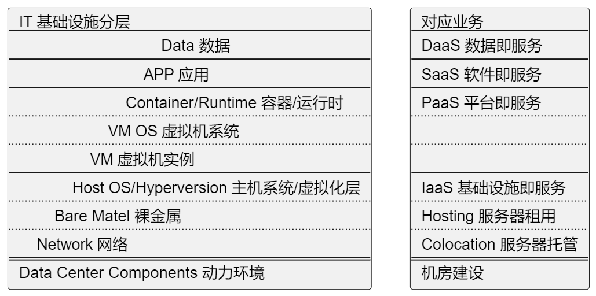

---
## 从资源使用的角度看云架构的演进
The cloud architectural evolution from a resource utilization point of view


---
## 机房动力环境监控 
Data Center components monitoring
<br>

动力：市电、电源、蓄电池、UPS、发电机等
环境：温湿度、烟雾、漏水、门禁、视频等
监控：遥测、遥信、遥控、遥调


---

## 网络 
Network
<br>

零配置部署 
Zero Touch Provisioning(ZTP)


---
## 裸金属  → 主机系统/虚拟化层 
Bare Metal → Host OS/Hyperversion
<br>


aka：装电脑，把系统镜像写入硬盘

---
Windows 
unattend.xml
```xml
<?xml version="1.0" encoding="utf-8"?>
<unattend xmlns="urn:schemas-microsoft-com:unattend">
    <settings pass="windowsPE">
    ...
     </settings>
    <settings pass="offlineServicing">
    </settings>
    ...
    <settings pass="specialize">
    ...
    </settings>
    <settings pass="oobeSystem">
    ...
    </settings>
</unattend>
```

安装命令：
通过iso进入安装环境，shift+10：
```cmd
setup /unattend:\path\to\unattend.xml
```

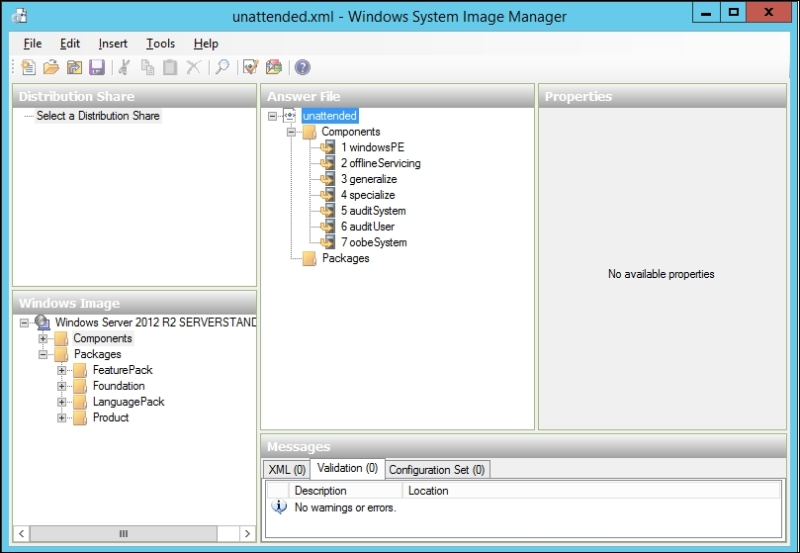


---
RedHat(RHEL, CentOS, Fedora)
kickstart.cfg
```shell
keyboard 'us'
lang en_US.UTF-8
rootpw root
timezone Asia/Shanghai
text
network --onboot=true --bootproto=dhcp --hostname=fedora
clearpart --all --initlabel
autopart
selinux --permissive
firewall --enabled --service=ssh
poweroff
%packages --excludedocs
@core
@cloud-server
hyperv-daemons
%end
```
安装命令：
通过iso进入安装环境，c：
```shell
setparams 'kickstart'
linuxefi /images/pxeboot/vmlinuz inst.stage2=hd:LABEL=xxx inst.ks=hd:LABEL=cidata:/xxx.cfg
initrdefi /images/pxeboot/initrd.img
boot
```

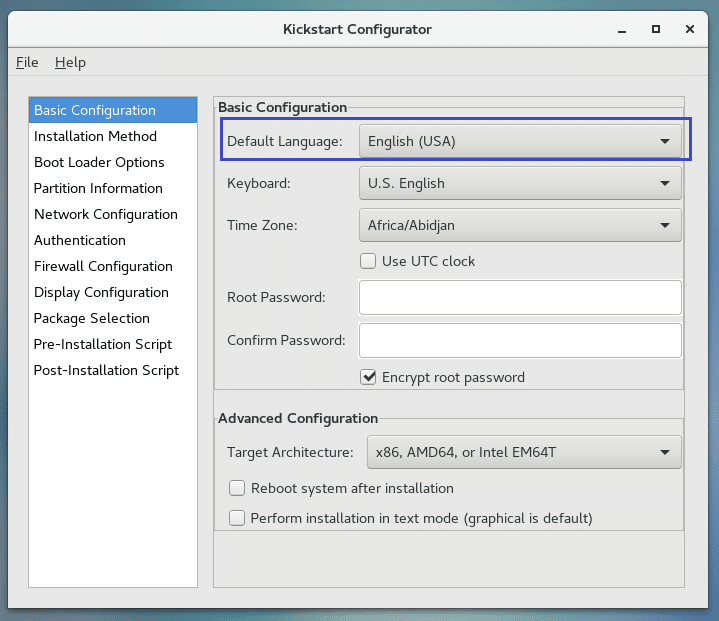
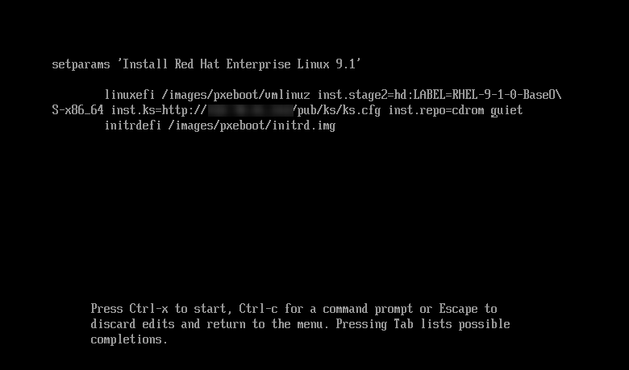

---
Debian
preseed.cfg
```shell
d-i auto-install/enable boolean true
d-i debian-installer/language string en
d-i debian-installer/country string CN
d-i debian-installer/locale string en_US.UTF-8
d-i keyboard-configuration/xkb-keymap select us
d-i netcfg/choose_interface select auto
d-i passwd/root-login boolean false

d-i partman-partitioning/confirm_write_new_label boolean true
d-i partman/choose_partition select finish
d-i partman/confirm boolean true
d-i partman/confirm_nooverwrite boolean true

d-i apt-setup/services-select multiselect security, updates
d-i apt-setup/security_host string mirrors.ustc.edu.cn

apt-cdrom-setup apt-setup/cdrom/set-first boolean false

apt-mirror-setup apt-setup/use_mirror boolean true
```
安装命令：
通过iso进入安装环境，c：
```shell
linux /install.amd/vmlinuz auto=true file=/cdrom/debian-preseed.cfg ...
initrd /install.amd/initrd.gz
boot
```

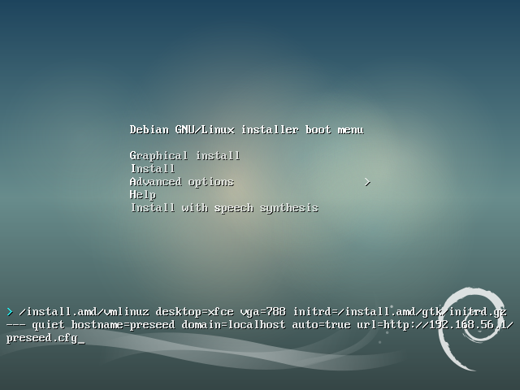

---
Ubuntu
Cloud-init autoinstall
```yaml
#cloud-config
autoinstall:
  version: 1
  updates: security
  apt:
    ...
  identity:
    hostname: hostname
    password: xxxxxxxxxxxxxxxxxxxxxxxxxxxxxxxxxxxxxxxxxx
    realname: Admin
    username: admin
  refresh-installer:
    update: no
  ssh:
    ...
  storage:
    layout:
      name: lvm
  late-commands:
    - |
      ...
```
安装命令：
通过iso进入安装环境，c：
```shell
linux /casper/vmlinuz --- autoinstall ds=nocloud;s=/cidata
initrd /casper/initrd.gz
boot
```


---
Ventoy
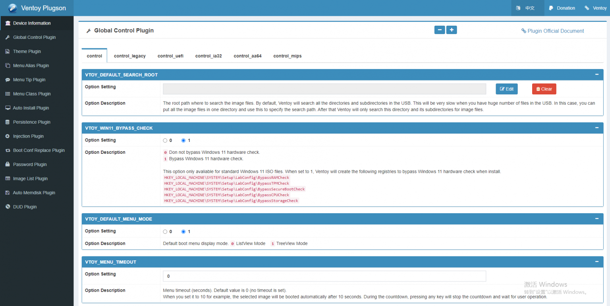


---
Ventoy：
ventoy.json  
```json
{
    "control":[
        { "VTOY_DEFAULT_SEARCH_ROOT": "/ISO" }
    ],
    "auto_install":[
        {
            "parent": "/ISO/Windows",
            "template":[
                "/WinOS-Deploy-As-Code/unattendXML/unattend-UEFI-512G.xml"
            ]
        }
    ]
}
```
U盘目录结构
```
   E:\
   +--WinOS-Deploy-As-Code
   |  +--unattendXML
   |  |  +--unattend-UEFI-512G.xml
   |  |  \...      
   |  +--Drivers
   |  |  \...
   |  +--oobeSystem
   |  |  \--...
   |  \--...
   +--ISO
   |  \--Windows
   |     \--Win11_EnglishInternational_x64v1.iso
   \--ventoy
          \--ventoy.json  
```


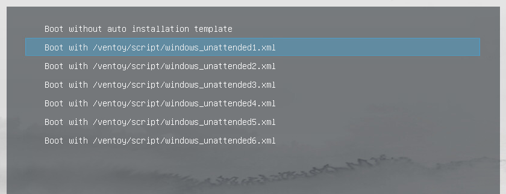


---

Canonical MAAS

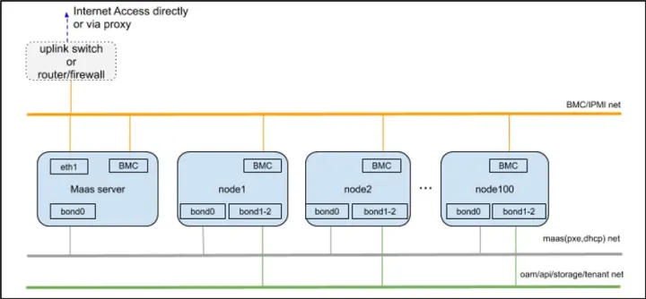


--- 
### 虚拟化层 → 虚拟机镜像 
Hyperversion → VM Image
<br>

Hashicorp Packer
涉及对象
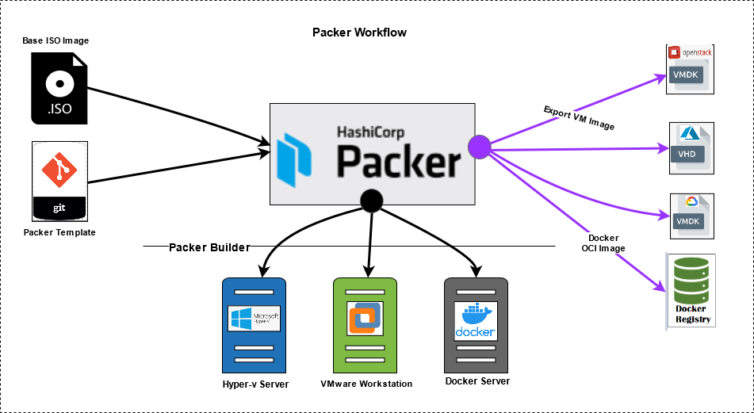

---

<style>
.container{
    display: flex;
}
.col{
    flex: 1;
}
</style>

<div class="container">

<div class="col">
Hashicorp Packer
虚拟机镜像构建步骤
代码示例:

```hcl
variable "vm_name" {
  type    = string
  default = ""
}

variable "boot_command" {
  type    = list(string)
}

source "hyperv-iso" "vm" {
  vm_name               = "${var.vm_name}"
  boot_command          = "${var.boot_command}"
  boot_wait             = "5s"
  ...
}

build {
  sources = ["source.hyperv-iso.vm"]

  post-processor "vagrant" {
    keep_input_artifact  = true
    output               = "${var.output_vagrant}"
    vagrantfile_template = "${var.vagrantfile_template}"
  }
}
```

</div>

<div class="col">

<br>
执行命令：

```powershell
packer build -var-file="$var_file" "$template_file"
```


</div>
</div>

---
### 虚拟机镜像 → 虚拟机实例
VM Image → VM Instance
<br>

Hashicorp Terraform

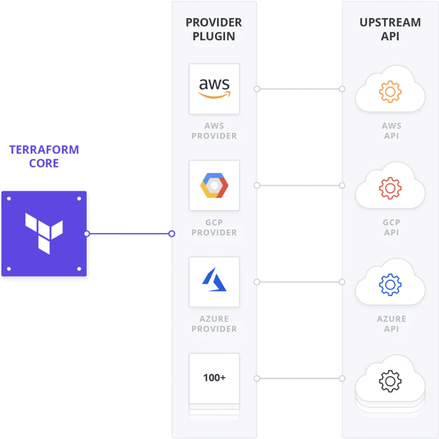

---
<style>
.container{
    display: flex;
}
.col{
    flex: 1;
}

</style>

<div class="container">

<div class="col">

Hashicorp Terraform
代码示例：
main.tf
```tf
terraform {
  required_providers {
    hyperv = {
      source  = "taliesins/hyperv"
      version = ">=1.0.4"
    }
  }
}

provider "hyperv" {
  user     = var.user
  password = var.password
  host     = var.host
  port     = 5986
  timeout     = "30s"
}

variable "user" {
  type    = string
  default = null
}
...

resource "hyperv_vhd" "InfraSvc-Data" {
  path       = "\\path\\to\\InfraSvc-Data.vhdx"
  vhd_type   = "Dynamic"
  size       = 21474836480 #20GB
}
```
</div>

<div class="col">

<br>
<br>

执行命令：
```bash
terraform init
terraform plan
terraform apply
```

<br>


<br>
<br>
<br>


</div>

</div>


---
### 操作系统 → 配置管理
OS → Configuration Management

Ansible
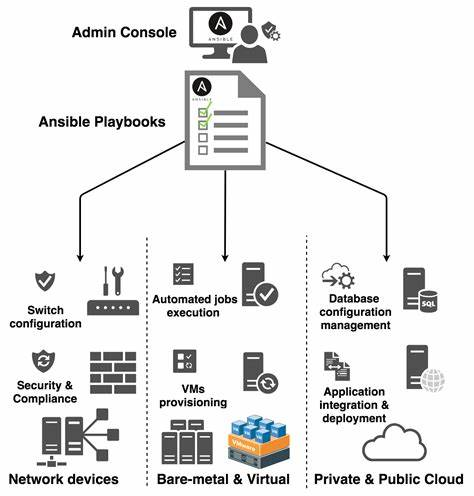
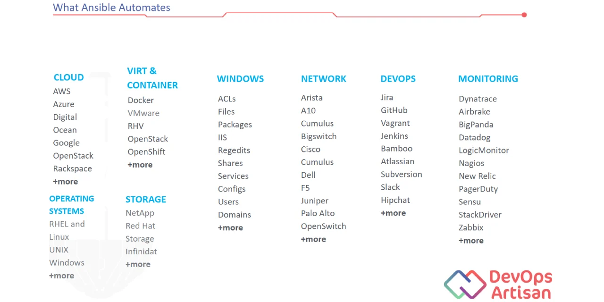


---

ansible 代码示例：
playbook.yml
```yaml
# code: language=ansible
---
- hosts: kube-1
  gather_facts: true
  become: yes
  tasks:
    - name: run terraform
      community.general.terraform: 
        project_path: 'project/'
        state: "{{ state }}"
        force_init: true
        backend_config:
          region: "eu-west-1"
          bucket: "some-bucket"
          key: "random.tfstate"
```
执行命令：
```bash
ansible-playbook /path/to/playbook.yml -e state=present
```


---

Ansible Execution Environment

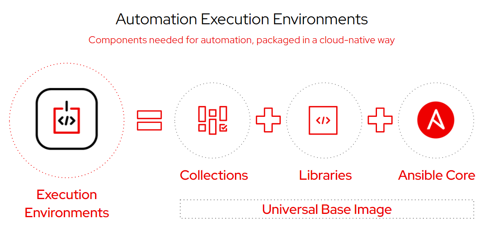
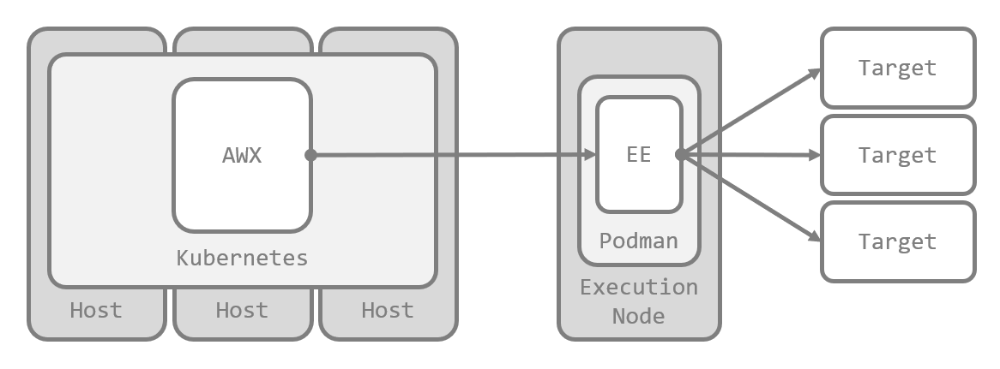

---
Ansible EE build process


---

Ansible VS Terraform

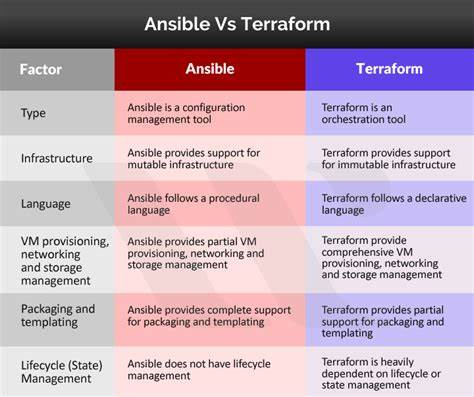
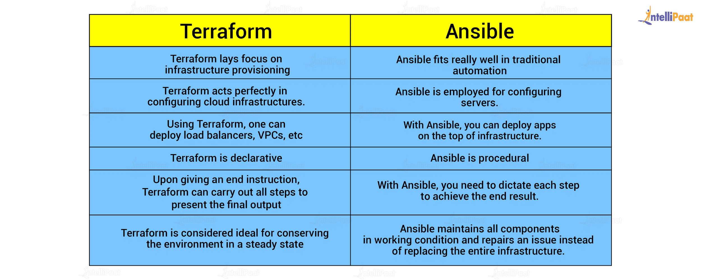

---
### 更多的自动化工具
chef
pupet
cloud-init
powershell dsc
